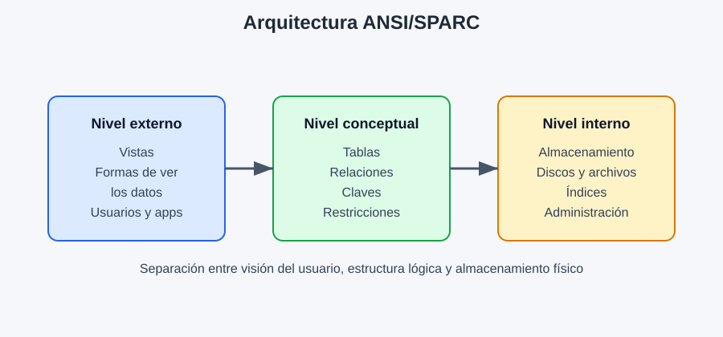

# 1. Arquitectura en niveles de las bases de datos

El comité **ANSI/SPARC** definió en **1975** una arquitectura de tres niveles para organizar los datos de una base de datos y separar la forma en que los usuarios la ven de cómo realmente se almacenan.

Esta arquitectura es fundamental porque permite que los sistemas sean más flexibles, seguros y fáciles de mantener.

## Introducción

Una base de datos no puede tratarse como un único bloque de información. Para facilitar su gestión, se divide en varios niveles de abstracción:

- nivel externo o de visión
- nivel conceptual o lógico
- nivel interno o físico

Esta separación permite que los usuarios trabajen con una representación sencilla del contenido, mientras el sistema gestiona los detalles técnicos del almacenamiento.

## Arquitectura en tres niveles

| Nivel | Función principal | Elementos que describe | Ejemplos de uso |
| :--- | :--- | :--- | :--- |
| **Externo o de visión** | Representa la información que necesita cada usuario o aplicación. | Vistas y subconjuntos de datos relevantes para cada perfil. | Un cliente ve sus pedidos; un administrador ve usuarios, permisos y estadísticas; un empleado ve su horario o nómina. |
| **Conceptual o lógico** | Define la estructura general de la base de datos y las relaciones entre los datos. | Tablas, atributos, relaciones, claves primarias y foráneas y restricciones de integridad. | Diseñadores y programadores definen cómo se organiza la información. |
| **Interno o físico** | Describe cómo y dónde se almacenan realmente los datos. | Archivos, ubicación física, índices y estructuras de almacenamiento. | Los administradores gestionan el almacenamiento y la organización física del sistema. |

### Ventajas de la arquitectura en niveles

La principal ventaja de esta arquitectura es que proporciona **independencia lógica y física**.

- **Independencia lógica** : Permite cambiar la estructura lógica de la base de datos sin que se tengan que reescribir todas las aplicaciones que la utilizan. Por ejemplo se puede añadir un nuevo atributo a una tabla y la aplicación puede seguir funcionando si la vista sigue siendo compatible.

- **Independencia física** : Permite cambiar la forma en que se almacenan los datos físicamente, por ejemplo moviéndolos a otro disco o cambiando el formato de almacenamiento, sin afectar a las aplicaciones.

### Importancia de esta arquitectura

La arquitectura en niveles hace que la base de datos sea:

- más flexible
- más mantenible
- más segura
- más fácil de adaptar a cambios
- más independiente de la tecnología concreta del almacenamiento

En resumen, gracias a esta separación de niveles, los datos pueden gestionarse de forma ordenada y sin depender de detalles internos que no interesan a las aplicaciones.
