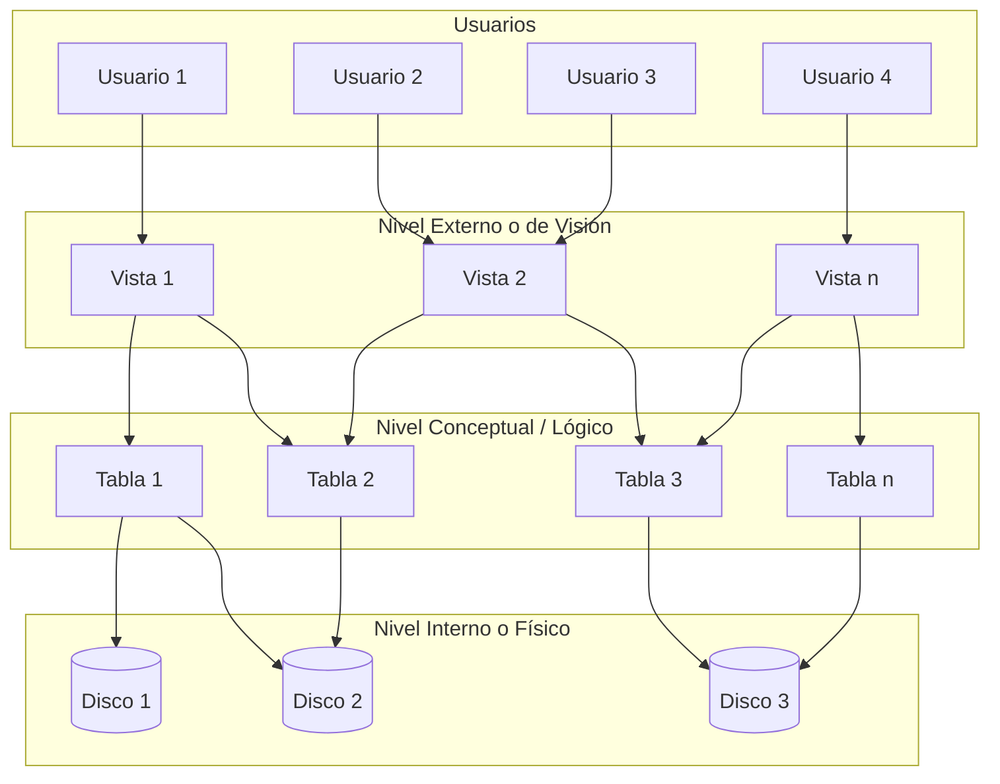

# 1. Arquitectura en niveles de las bases de datos

El comité **ANSI/SPARC** definió en **1975** una arquitectura de tres niveles para los sistemas gestores de bases de datos.

## Nivelación de la Arquitectura

### Definición de los Niveles

* **Nivel externo o de visión:** Se compone de las distintas aplicaciones basadas en vistas de la base de datos. Es lo que ven los usuarios finales.
* **Nivel conceptual:** Se compone de las distintas tablas con sus atributos. Es el nivel que conocen los programadores.
* **Nivel interno o físico:** Define qué discos y archivos componen la base de datos y qué hay en cada uno de ellos. Sólo acceden a este nivel los administradores.

---

## Ventajas de la Arquitectura en Niveles

La principal ventaja de esta arquitectura en niveles es que proporciona **independencia lógica y física** de los datos respecto a las aplicaciones:

* **Independencia lógica:** Se pueden realizar cambios en el nivel conceptual (como añadir tablas o atributos) sin que sea necesario reescribir todas las aplicaciones.
* **Independencia física:** Es posible modificar la ubicación de los ficheros que contienen los datos sin que se vean afectadas las aplicaciones.
