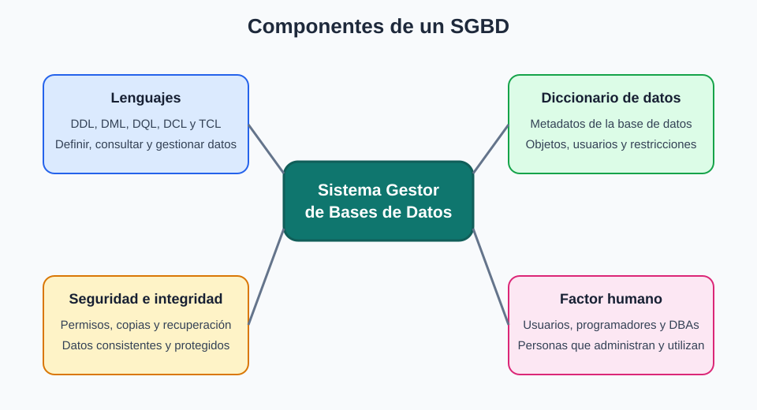

# 2. Componentes de un SGBD

Generalmente, un SGBD se compone de varios elementos relacionados entre sí:

- Lenguajes
- El diccionario de datos
- Mecanismos de seguridad e integridad
- Factor humano

---

## Lenguajes

Los lenguajes de un SGBD permiten definir la estructura de los datos, consultarlos y modificarlos, establecer restricciones y gestionar las operaciones del sistema gestor. Estas funciones pueden implementarse de forma diferente según el modelo de datos.

Entre otras tareas, estos lenguajes deben permitir:

* **Definir la estructura de la base de datos:** Crear y modificar objetos como tablas, vistas, usuarios, procedimientos, funciones y triggers. En los SGBD relacionales, estas operaciones se realizan habitualmente mediante sentencias **DDL** (*Data Definition Language* o Lenguaje de Definición de Datos), como `CREATE`, `ALTER` y `DROP`.
* **Manipular la información:** Insertar, modificar y eliminar datos almacenados. En los SGBD relacionales, estas operaciones se realizan mediante sentencias **DML** (*Data Manipulation Language* o Lenguaje de Manipulación de Datos), como `INSERT`, `UPDATE` y `DELETE`.
* **Consultar la información:** Recuperar datos almacenados. En los SGBD relacionales, la sentencia principal es `SELECT`, que puede combinarse con `WHERE`, `ORDER BY`, `GROUP BY` y `HAVING`. Estas consultas se suelen agrupar bajo el concepto **DQL** (*Data Query Language* o Lenguaje de Consulta de Datos).
* **Gestionar permisos:** Controlar los privilegios de los usuarios. En los SGBD relacionales que utilizan SQL, se emplean sentencias **DCL** (*Data Control Language* o Lenguaje de Control de Datos), como `GRANT` y `REVOKE`.
* **Gestionar transacciones:** Confirmar o deshacer operaciones relacionadas entre sí. En los SGBD relacionales que utilizan SQL, se emplean sentencias **TCL** (*Transaction Control Language* o Lenguaje de Control de Transacciones), como `COMMIT`, `ROLLBACK` y `SAVEPOINT`.

!!! info "Lenguajes de cuarta generación (4GL)"
    Algunos SGBD incorporan herramientas o lenguajes de cuarta generación (4GL) para facilitar el desarrollo rápido de aplicaciones (RAD). Por ejemplo, permiten generar formularios, informes o consultas mediante asistentes y componentes visuales.

---

## El diccionario de datos

El diccionario de datos contiene toda la información sobre los datos de la BD, es decir, los **metadatos** (datos acerca de los datos) de la base de datos. Esto incluye:

* La definición de todos los objetos existentes en la base de datos: tablas con sus columnas, vistas, procedimientos, triggers, índices, etc.
* La ubicación física de los objetos y el espacio asignado a estos.
* Los privilegios y roles asignados a los usuarios.
* Las restricciones de las tablas.
* Estadísticas de uso de la base de datos.
* Información del consumo de recursos actual.
* Información de los usuarios.
* Y otra información necesaria para administrar la base de datos.

---

## Mecanismos de seguridad, integridad y recuperación

Un SGBD debe proporcionar mecanismos y utilidades que permitan:

* Realizar copias de seguridad y restaurar los datos cuando sea necesario.
* Proteger los datos frente a accesos no autorizados mediante usuarios, roles y permisos.
* Aplicar restricciones de integridad para evitar datos incorrectos o inconsistentes.
* Recuperar la base de datos hasta un estado consistente después de un fallo.
* Controlar el acceso concurrente de los usuarios para evitar conflictos entre transacciones.

---

## El factor humano

Un SGBD siempre va a tener distintas categorías de usuarios:

* **Usuarios finales:** Acceden a la información y a las aplicaciones para las que tienen permisos.
* **Programadores:** Desarrollan aplicaciones que utilizan la base de datos y facilitan el trabajo de los usuarios finales.
* **Administradores o DBAs:** Garantizan el funcionamiento correcto del sistema, gestionan sus recursos y controlan su seguridad, disponibilidad y rendimiento. Sus responsabilidades concretas dependen de la organización y de la normativa aplicable.

!!! note "Enfoque del módulo"
    En este módulo nos vamos a centrar en realizar tareas propias del **DBA**.
