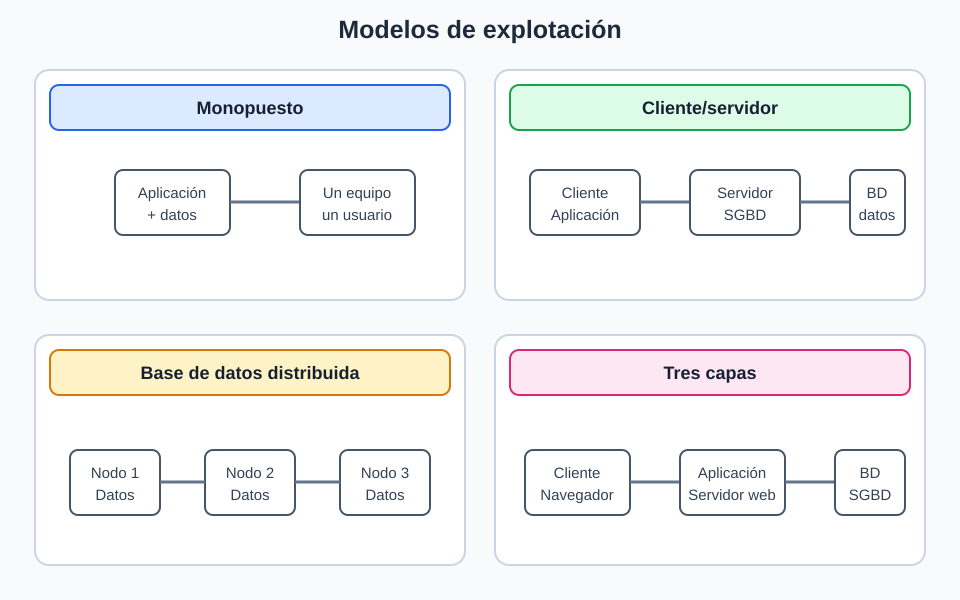
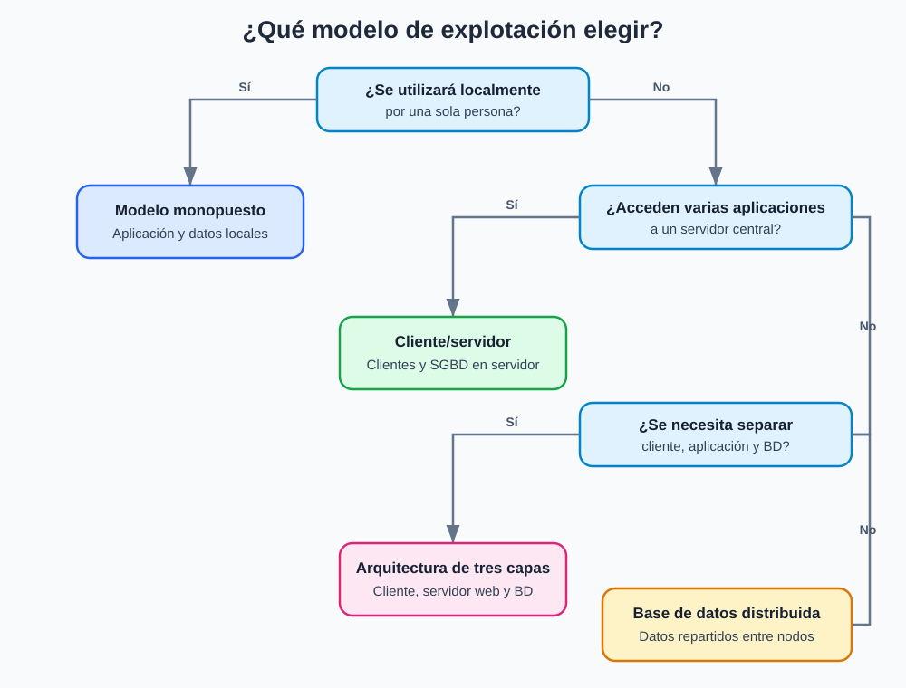

# 3. Modelos de explotación de las bases de datos

Los SGBD pueden instalarse y utilizarse siguiendo diferentes modelos de explotación, según el número de usuarios, la ubicación de los datos y la forma de acceder al sistema. Estos modelos describen cómo se organiza el acceso a la base de datos; no deben confundirse con los modelos de datos, como el relacional, el documental o el de grafos.

| Modelo | Descripción | Ejemplos / Notas |
| :--- | :--- | :--- |
| **Monopuesto** | La base de datos y la aplicación se ejecutan en el mismo equipo, normalmente para un único usuario o para un uso local. | Habitual en algunas aplicaciones de escritorio. |
| **Cliente/servidor** | El SGBD se ejecuta en un servidor y recibe peticiones de una o varias aplicaciones cliente. | Es el modelo principal utilizado en este módulo. |
| **Base de datos distribuida** | Los datos se almacenan en varios equipos o nodos que cooperan para ofrecer el servicio. | Puede mejorar la disponibilidad, la escalabilidad o el rendimiento, aunque aumenta la complejidad de gestión. |
| **Tres capas** | La aplicación se organiza en cliente, servidor de aplicaciones o web y servidor de bases de datos. | Es una arquitectura de aplicaciones que suele utilizarse junto con el modelo cliente/servidor. |

## Criterios para elegir un modelo

La elección del modelo de explotación depende de las necesidades de la organización. Conviene valorar los siguientes aspectos:

* **Número de usuarios:** una aplicación local puede ser suficiente para un único usuario, mientras que muchos usuarios suelen requerir un servidor centralizado.
* **Volumen de datos y rendimiento:** cuando aumentan los datos o las consultas, puede ser necesario distribuir la carga entre varios servidores.
* **Disponibilidad:** los servicios que deben estar operativos continuamente pueden necesitar réplicas o varios nodos para reducir el impacto de los fallos.
* **Seguridad:** centralizar el acceso facilita aplicar permisos, autenticación y auditorías.
* **Mantenimiento y coste:** las soluciones distribuidas ofrecen más posibilidades de crecimiento, pero requieren una administración más compleja.

Esta infografía resumen el árbol de decisión para elegir un modelo de explotación.

!!! example "Ejemplo de combinación de modelos"
    Una tienda en línea puede utilizar una arquitectura de **tres capas**: el navegador del cliente se comunica con un servidor web o de aplicaciones, y este accede al servidor de bases de datos. Si la base de datos se replica en varios servidores para mejorar la disponibilidad, también se está utilizando un modelo de **base de datos distribuida**.

    Esto muestra que los modelos no siempre son excluyentes: una misma solución puede ser cliente/servidor, estar organizada en tres capas y utilizar una base de datos distribuida al mismo tiempo.

!!! note "Uso en el módulo"
    En este módulo utilizaremos principalmente el **modelo cliente/servidor**. También veremos algunas características de los **SGBD distribuidos** en el tema correspondiente.
