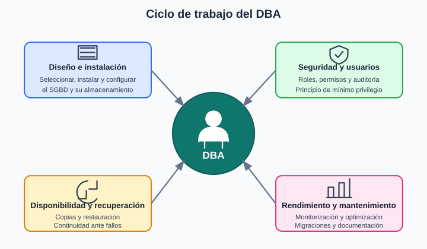

# 4. Tareas de un DBA

El **DBA** (*Database Administrator* o administrador de bases de datos) es el profesional responsable de planificar, configurar, proteger y mantener las bases de datos de una organización. Aunque suele disponer de privilegios elevados, sus permisos deben estar controlados y utilizarse siguiendo el principio de mínimo privilegio.

## Principales responsabilidades según áreas

### Diseño e instalación

* Evaluar y seleccionar el SGBD más adecuado para cada proyecto.
* Instalarlo, configurarlo y aplicar las actualizaciones necesarias.
* Colaborar en el diseño lógico de la base de datos.
* Definir el diseño físico, el almacenamiento y los índices.

### Seguridad y administración de usuarios

* Crear y mantener cuentas, roles y permisos.
* Proteger los datos frente a accesos no autorizados.
* Revisar los registros de actividad y colaborar en las auditorías de seguridad.

### Disponibilidad y recuperación

* Planificar y verificar las copias de seguridad.
* Restaurar la base de datos y recuperar el servicio después de un fallo.
* Planificar medidas de alta disponibilidad y continuidad del servicio cuando sean necesarias.

### Rendimiento y mantenimiento

* Monitorizar el uso de recursos y detectar problemas de rendimiento.
* Optimizar consultas, índices y parámetros de configuración.
* Realizar migraciones, importaciones y exportaciones de datos.
* Documentar la configuración y los procedimientos de administración.

Además, el DBA puede colaborar con los equipos de desarrollo y participar en la formación de usuarios y programadores.

---

