# Servidor Linux en AWS Academy

En esta práctica crearás una máquina virtual Linux en AWS y accederás a ella desde una terminal mediante SSH. No tendrá entorno gráfico.

Accede al [portal de AWS Academy](https://www.awsacademy.com/vforcesite/LMS_Login) con tu cuenta.

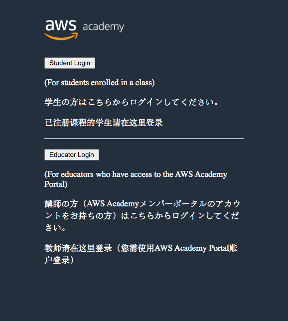

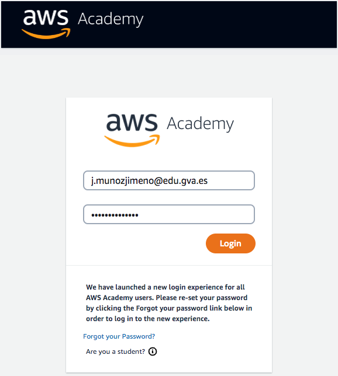

En las imágenes, los cuadros rojos señalan las opciones que debes seleccionar o revisar. De momento, no cambies las demás.

Accede al LMS, donde encontrarás los cursos disponibles.

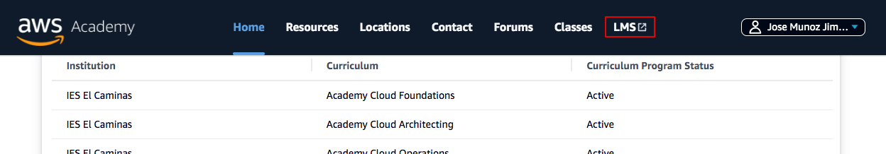

Busca el **Learner Lab** que tu profesor ha preparado para este curso. Previamente te habrá invitado y habrás tenido que aceptar la invitación para tener acceso al mismo.

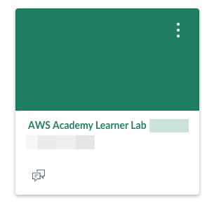

Selecciona "Módulos" o "Contenidos" para acceder al laboratorio.

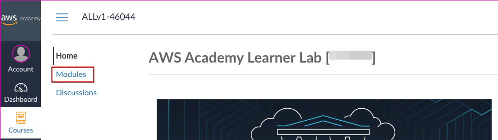

Abre el "Laboratorio de Aprendizaje".

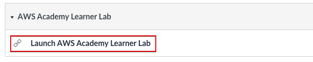

Inicia el laboratorio:

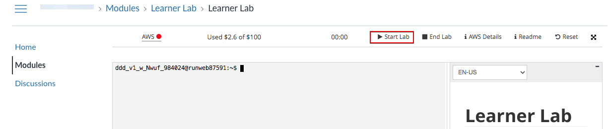

Una vez iniciado, verás un punto verde junto a **AWS**. Haz clic allí para abrir la consola de AWS y comenzar a trabajar.

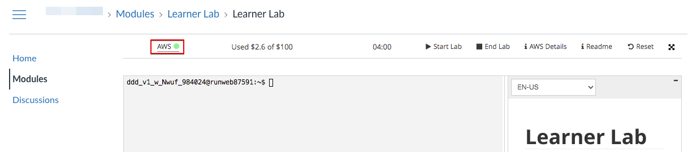

Ya estás en la consola de AWS. Su aspecto puede variar ligeramente según la versión de la interfaz.

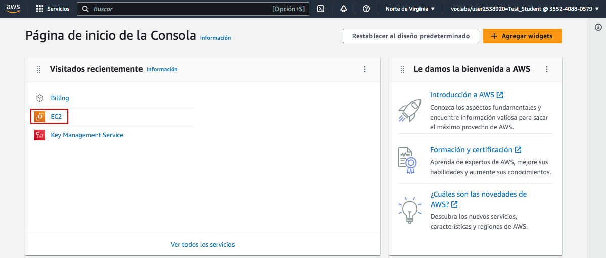

En AWS, el servicio para crear servidores virtuales se llama **EC2**. Haz clic en **EC2** y, en la pantalla siguiente, selecciona **Lanzar instancia**.


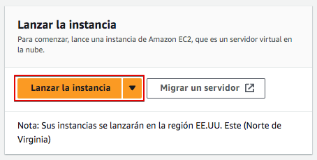

Ahora configura la máquina siguiendo las indicaciones de las capturas y del profesor.

Crearemos un servidor Debian. Primero, escribe un nombre que te permita reconocer la instancia, por ejemplo `ASGBD-Linux`.

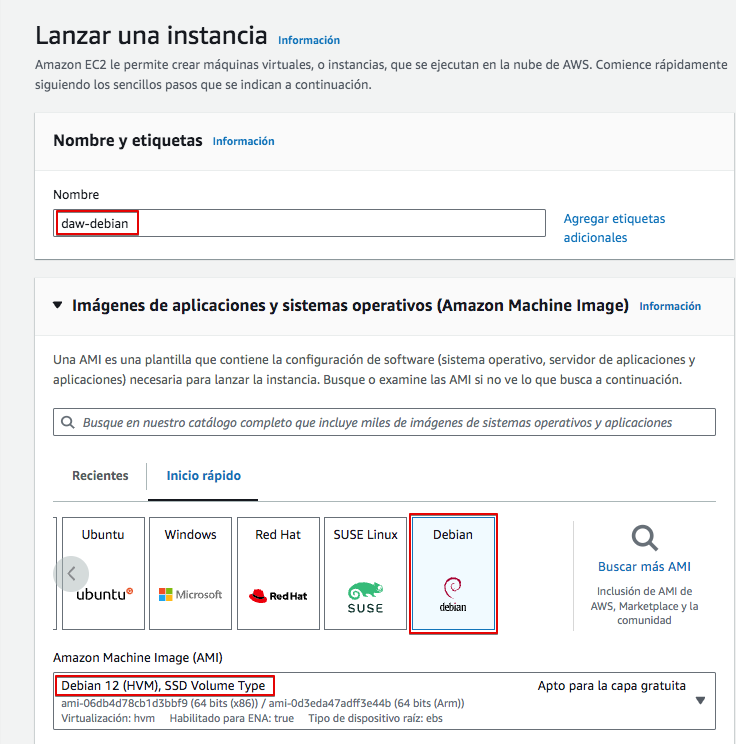

A continuación, selecciona el tipo de instancia indicado por el profesor. El tipo determina la CPU y la memoria; uno más potente puede consumir más créditos del laboratorio.

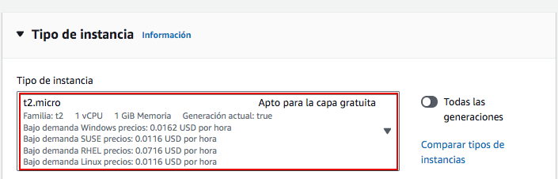

En **Par de claves (inicio de sesión)**, crea un par de claves para poder entrar por SSH. Ponle un nombre reconocible, por ejemplo `asgbd-linux`. La clave privada se descarga al crearla y AWS no permite volver a descargar ese mismo archivo.

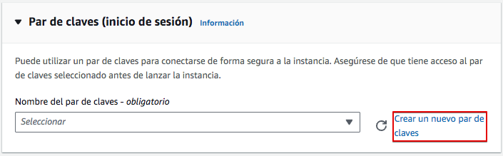

Guarda el archivo de clave privada en una carpeta segura de tu ordenador y conserva su nombre y extensión. No lo subas al repositorio ni lo compartas. Si pierdes el archivo, no podrás usarlo para autenticarte en esta instancia.

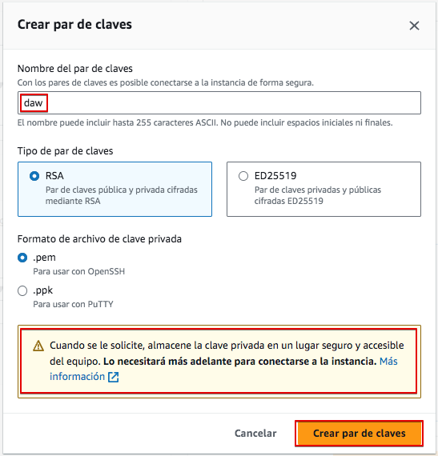

Ahora, tras volver a la pantalla anterior, selecciona el par de claves generadas.

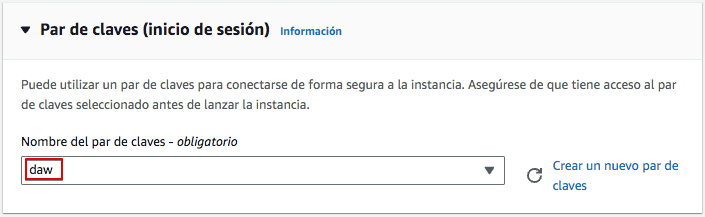

Ahora configura la red. El **grupo de seguridad** funciona como un cortafuegos: sus reglas controlan qué conexiones pueden llegar a la instancia. Para esta práctica necesitamos SSH por el puerto TCP 22. En el origen de la regla, selecciona **Mi IP** para limitar el acceso a tu conexión. No dejes SSH abierto a cualquier dirección (`0.0.0.0/0`).

Para localizar fácilmente el grupo de seguridad después, asígnale un nombre reconocible, por ejemplo `ASGBD-Linux-SG`. Haz clic en **Editar**.

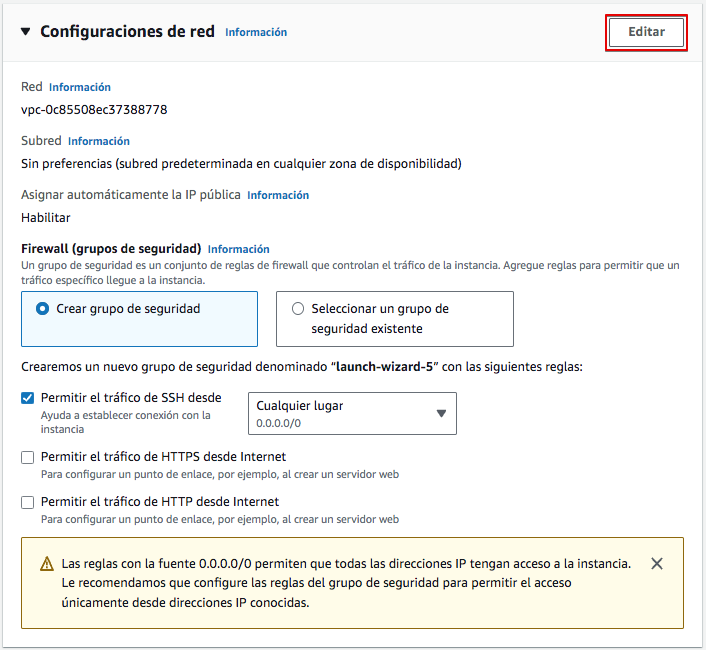

Ahora cambia el nombre y la descripción del grupo de seguridad como en la imagen.

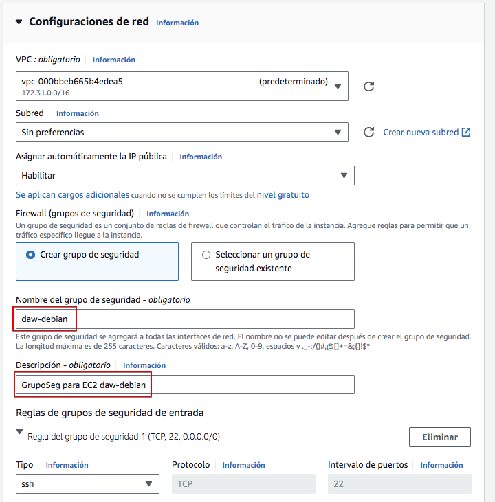

En **Configurar almacenamiento**, deja el tamaño indicado por el profesor (en estas capturas, 20 GiB). Comprueba también que el volumen raíz se elimine al terminar la instancia si no necesitas conservarlo.

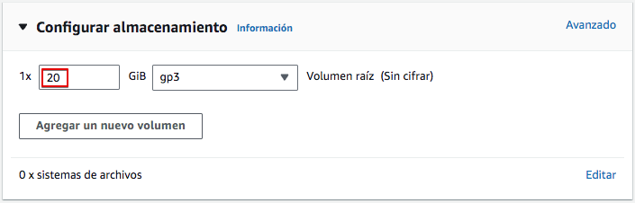

Verifica todas las opciones seleccionadas y lanza la instancia.

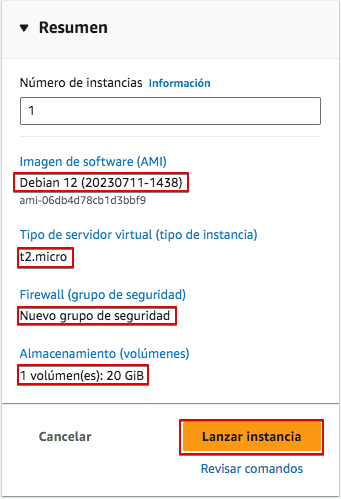

Si todo va bien, la instancia se creará y obtendremos un mensaje que lo indica.

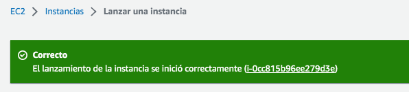

Haz clic en el identificador de la instancia para abrir sus detalles. Comprueba que su estado sea **En ejecución** y localiza la **Dirección IPv4 pública**. No la confundas con la dirección IPv4 privada, que se utiliza dentro de la red de AWS.

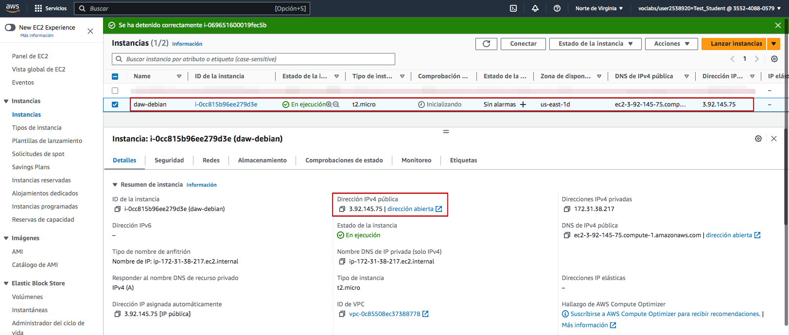

Para conectarte, selecciona la instancia y haz clic en **Conectar**. Abre la pestaña **Cliente SSH**: allí verás el nombre de usuario y un ejemplo de comando para tu instancia. El usuario depende de la imagen Debian seleccionada; utiliza el que indique la consola.

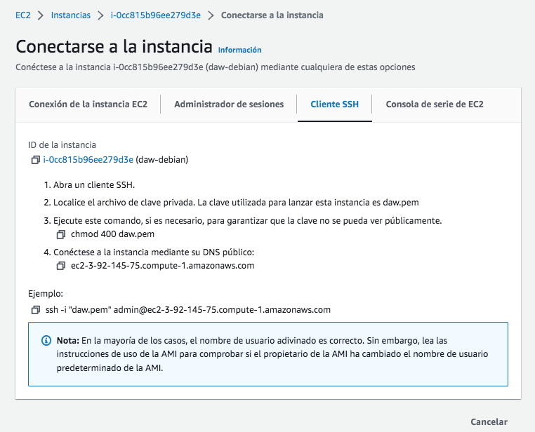

!!! tip "Conexión desde Windows"
    Puedes ejecutar el comando SSH desde PowerShell si OpenSSH está instalado. Usa la ruta real del archivo de clave que descargaste. Si Windows muestra un error de permisos sobre la clave, sigue las instrucciones que proporciona el propio mensaje o consulta al profesor.

Usa el archivo de clave privada que guardaste al crear el par. En el comando, sustituye la ruta, el usuario y la IP por los valores de tu equipo y de la consola. La extensión del archivo puede ser `.pem` u otra; no es necesario cambiarla.

```console
ssh -i "C:\ruta\a\tu-clave.pem" usuario@IP_PUBLICA
```

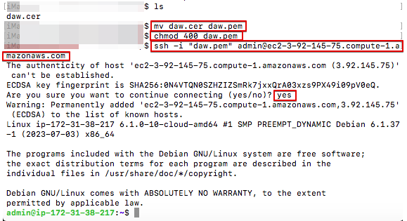

Si la conexión funciona, aparecerá la terminal del servidor Debian. La primera vez, SSH puede pedirte que confirmes la identidad del servidor; escribe `yes` si la IP y la instancia son las correctas.

Puedes comprobar que la capacidad del disco y la memoria coinciden con lo configurado en la consola de AWS.

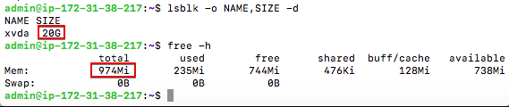

Para cerrar la conexión, escribe `exit`.

!!! warning "La IP puede cambiar"
    AWS puede asignar una IP pública nueva cuando se detiene y vuelve a iniciar la instancia. Consulta la IP actual antes de cada conexión.

## Detener la instancia

Al comenzar una sesión, revisa el estado de tus instancias. Si una está en ejecución y no la necesitas, detenla para evitar consumir créditos. Una instancia detenida no consume tiempo de ejecución, pero su almacenamiento EBS puede seguir consumiendo recursos.

Para detenerla, ve a **Instancias**, selecciónala y abre **Estado de la instancia**.

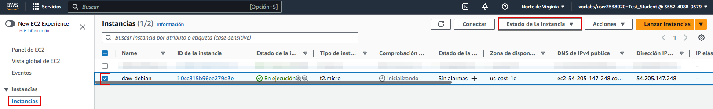

Selecciona **Detener instancia**.

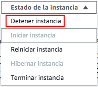

Comprueba que el estado de la instancia cambia a **Detenida**.


## Eliminar una instancia

Una instancia detenida conserva sus volúmenes EBS, que pueden seguir consumiendo recursos. Cuando ya no necesites la máquina ni sus datos, puedes terminarla.

Terminar una instancia es una acción definitiva: no podrás volver a iniciarla. Antes, guarda cualquier archivo que necesites. Selecciona la instancia y, en **Estado de la instancia**, elige **Terminar instancia**.

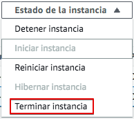

El estado cambiará a **Terminada**. Puede seguir apareciendo en el listado durante un tiempo, pero ya no se podrá iniciar de nuevo.


Al terminarla, los volúmenes configurados para eliminarse junto con la instancia se borrarán. Comprueba esta opción antes de confirmar, porque podrías perder los datos guardados en ellos.

Otros recursos, como el grupo de seguridad, pueden permanecer y habrá que eliminarlos por separado si ya no se usan.

Puedes consultar los distintos recursos existentes y eliminar los que no sean necesarios desde el panel de EC2.

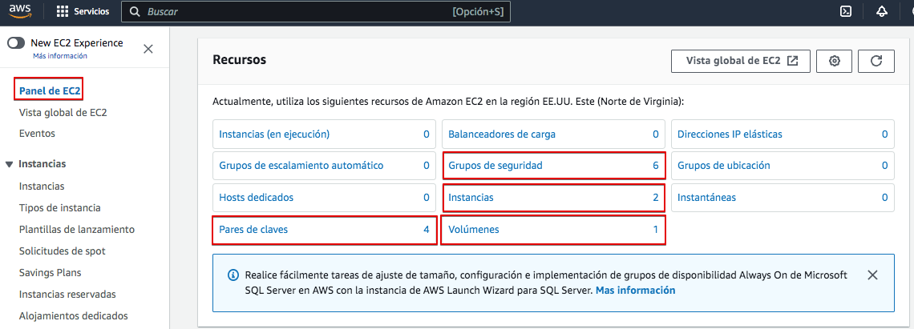

En **Grupos de seguridad**, localiza el grupo que creaste y elimínalo solo si ninguna otra instancia lo está utilizando.

## Finaliza el laboratorio

Al terminar la sesión, vuelve a AWS Academy y pulsa **Finalizar laboratorio**. Antes, detén o termina los recursos que ya no necesites. Finalizar el laboratorio cierra la sesión de trabajo; no des por hecho que elimina tus instancias o todos sus recursos.

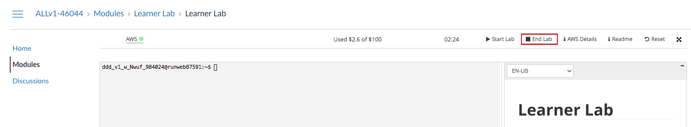

Comprueba que el laboratorio ha finalizado. El indicador junto a AWS debería aparecer apagado o en rojo, según la versión de la interfaz.

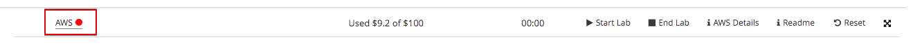


!!! warning
    Finaliza el laboratorio al acabar cada sesión y revisa que no queden recursos innecesarios.
