# Servidor Windows en AWS Academy

En esta práctica crearás una máquina virtual Windows en AWS y accederás a su escritorio mediante RDP (Escritorio remoto).

Accede a AWS Academy e inicia el laboratorio como en la práctica anterior. En las imágenes, los cuadros rojos señalan las opciones que debes seleccionar o revisar. No cambies las demás opciones salvo que lo indique el profesor.

En AWS, el servicio para crear servidores virtuales se llama **EC2**. Abre EC2 y selecciona **Lanzar instancia**.

Configura la máquina siguiendo las indicaciones del profesor y de las capturas.

En las capturas se utiliza Windows Server 2016. Selecciona la versión que indique el profesor. **Windows Server 2016 dejará de recibir soporte extendido el 12 de enero de 2027**, por lo que esta imagen debe usarse solo para la práctica indicada y no para desplegar servicios reales.

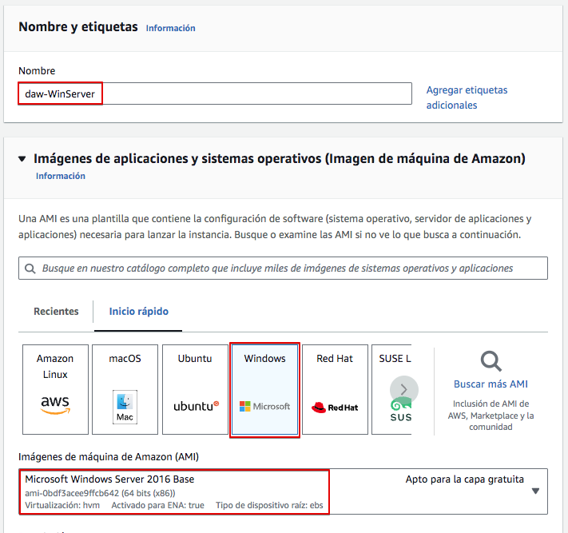

Selecciona el tipo de instancia indicado por el profesor. La captura muestra `t2.large` (2 CPU virtuales y 8 GiB de memoria); comprueba que esté disponible en la región del laboratorio. Un tipo mayor puede consumir más créditos.

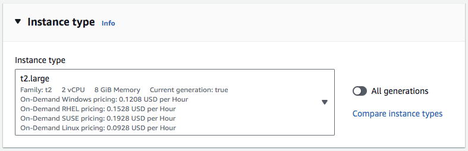

En **Par de claves (inicio de sesión)**, selecciona o crea el par de claves que se usará para recuperar la contraseña inicial de Windows. Puedes reutilizar el de la práctica anterior si aparece en la lista de esta región; los pares de claves pertenecen a una región concreta. Si creas uno nuevo, guarda su archivo privado de forma segura: AWS no permite descargarlo otra vez.

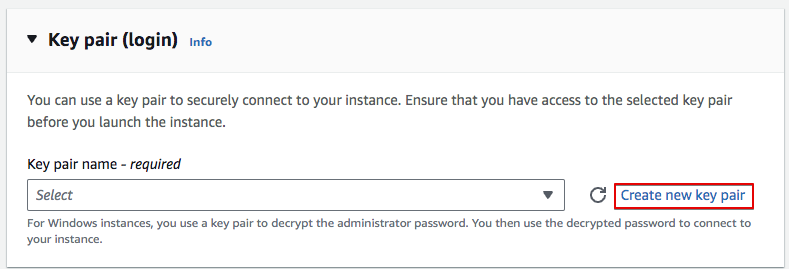

No compartas la clave privada ni la subas al repositorio. La necesitarás para descifrar la contraseña inicial.

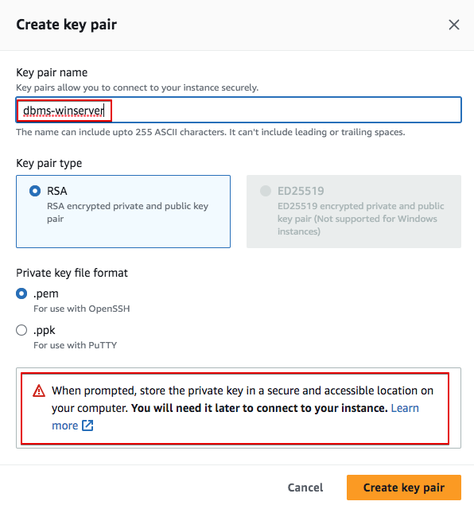

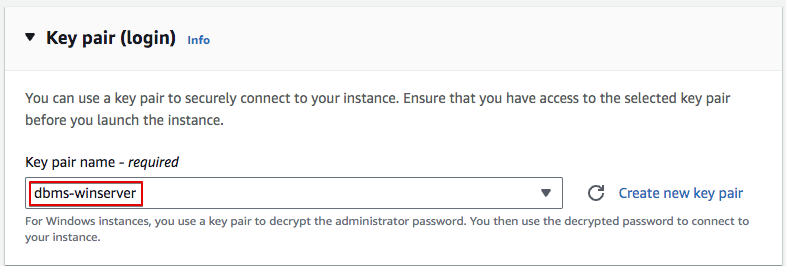

Si reutilizas un par de claves, continúa desde este punto.

Configura el grupo de seguridad, que actúa como cortafuegos. Para administrar la máquina, permite RDP (TCP 3389) solo desde **Mi IP**; no lo abras a todo Internet (`0.0.0.0/0`). Abre HTTP (TCP 80) y HTTPS (TCP 443) únicamente cuando la práctica incluya un servicio web. Si ese servicio debe ser accesible desde fuera del aula, el profesor indicará el origen permitido; para pruebas privadas, limita también esos puertos a **Mi IP**.

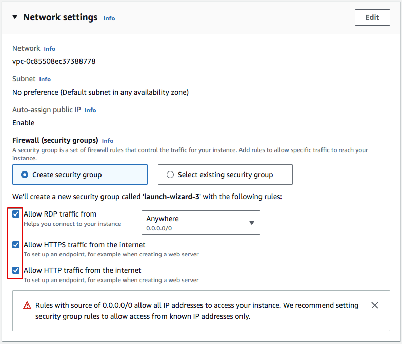

Pon un nombre reconocible al grupo de seguridad para encontrarlo y eliminarlo al terminar, por ejemplo `ASGBD-Windows-SG`.

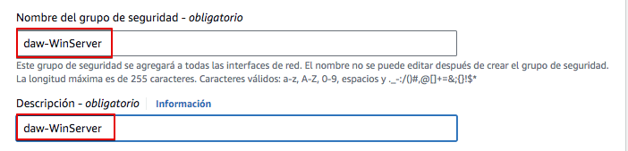

En **Configurar almacenamiento**, deja el tamaño indicado por el profesor (80 GiB en estas capturas). Revisa si el volumen raíz se eliminará al terminar la instancia.

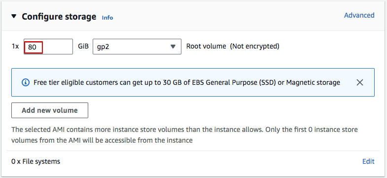

Verifica todas las opciones seleccionadas y lanza la instancia.

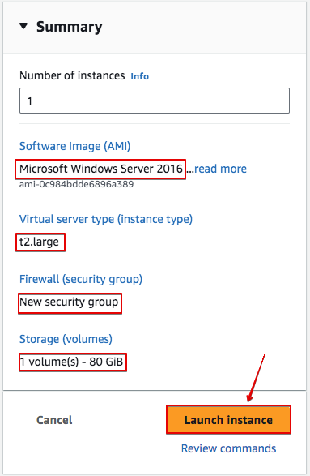

Si todo va bien, la instancia se creará y podrás verla en la consola de EC2.

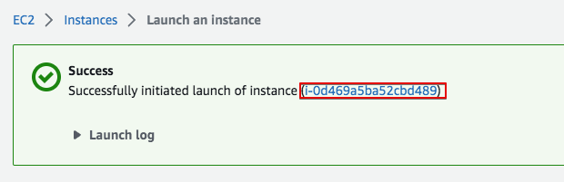

En EC2, comprueba que la instancia esté **En ejecución** y localiza su **Dirección IPv4 pública** o DNS público. Necesitarás ese dato para conectarte.

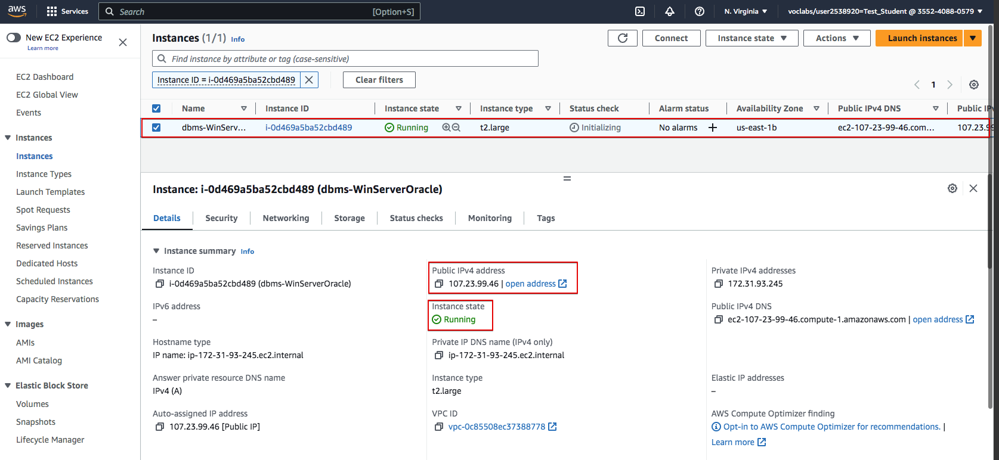

Para conectarte, selecciona la instancia y haz clic en **Conectar**. Abre la opción o pestaña **Cliente RDP**. A diferencia de Linux, Windows necesita una contraseña para el usuario `Administrator`.

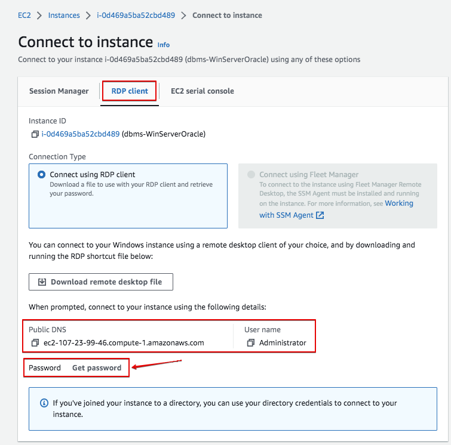

Pulsa **Obtener contraseña** o **Cargar archivo de clave privada**, según la interfaz. Selecciona el archivo privado correspondiente al par de claves asociado a esta instancia.

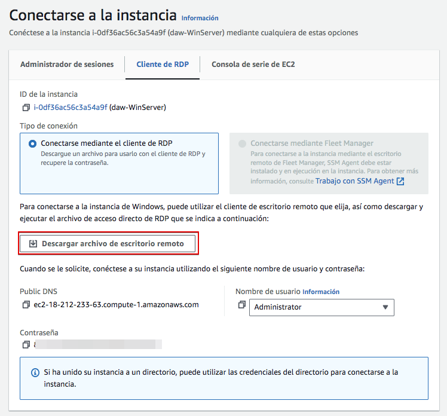

Cuando AWS haya generado la contraseña, pulsa **Descifrar contraseña**.

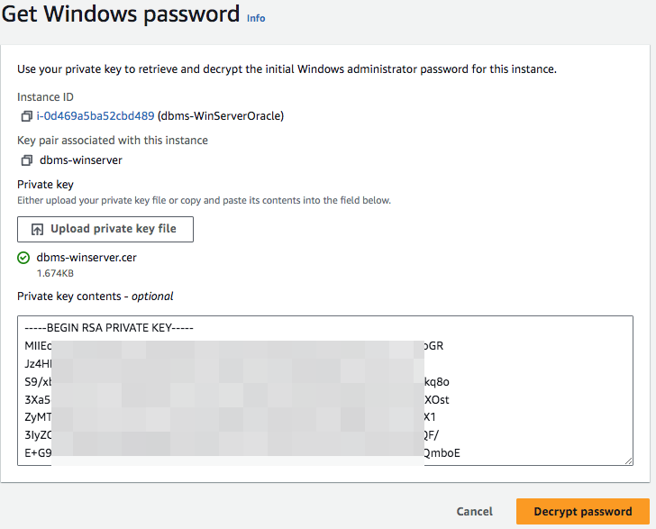

La consola mostrará la contraseña inicial de `Administrator`. Cópiala para usarla en la conexión. No la guardes junto con la clave privada ni en apuntes o documentos compartidos. Una vez dentro, cámbiala si el profesor lo indica.

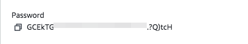

Para conectarte, necesitarás el DNS público o la IP actual, el usuario `Administrator` y la contraseña recién descifrada. Puedes usar un cliente RDP, como KRDC o Remmina en LliureX, o el cliente disponible en tu sistema operativo.

## Conexión usando KRDC

Estas capturas muestran una conexión con KRDC. Los nombres de algunas opciones pueden variar según la versión.

Selecciona el protocolo RDP e introduce el DNS público actual de la instancia (la imagen puede mostrar una IP antigua).

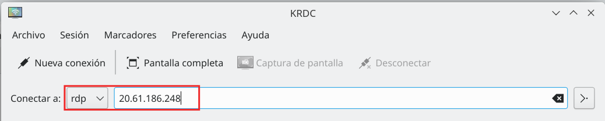

Puedes ajustar opciones como la resolución o el teclado. La carpeta compartida es opcional: úsala solo si necesitas transferir archivos y el equipo es de confianza.

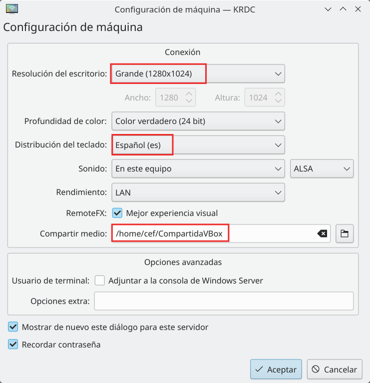

Cuando el cliente lo solicite, introduce `Administrator` y la contraseña descifrada. Si aparece un aviso de certificado, comprueba que estás conectando a la dirección de tu instancia antes de continuar.

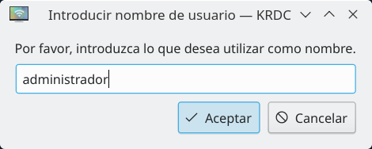

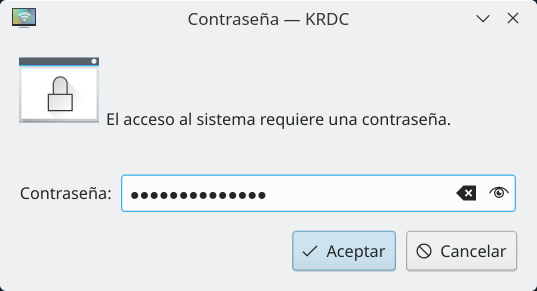

Se establecerá la conexión.

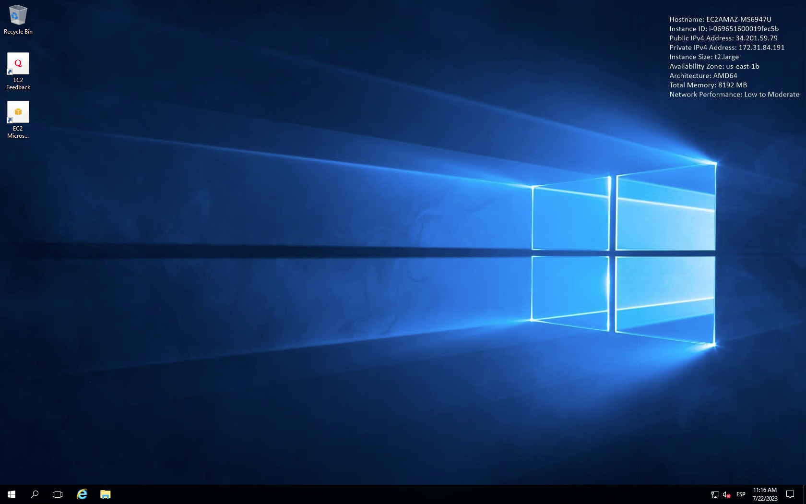

## Conexión usando Microsoft Remote Desktop

También puedes utilizar un cliente RDP disponible para tu sistema operativo. La aplicación y los nombres de los menús pueden cambiar según la versión.

Algunos clientes permiten compartir una carpeta local con la máquina. Es una opción, no un requisito para conectarse; compártela solo si necesitas transferir archivos.

Si no tienes un cliente RDP instalado, consulta al profesor cuál debes utilizar para tu sistema operativo.

AWS puede ofrecer la descarga de un archivo `.rdp` con los datos de conexión. Descárgalo solo en tu equipo y comprueba que corresponde a la instancia correcta antes de abrirlo. La contraseña se introduce aparte.

También puedes crear una conexión guardada desde tu cliente RDP. Los pasos y menús dependen de la aplicación.

Introduce el DNS público actual como nombre del equipo y `Administrator` como usuario. Usa la contraseña obtenida en la consola.

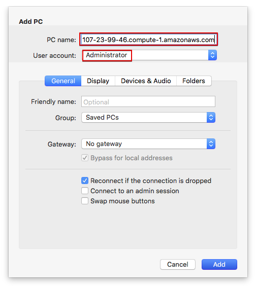

Si necesitas compartir una carpeta, créala primero en tu equipo y selecciónala en las opciones de recursos locales del cliente RDP.

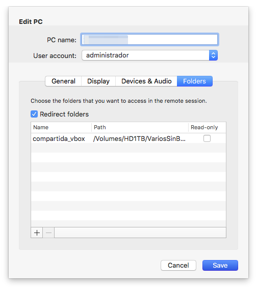

Al conectarte, la carpeta compartida puede aparecer como una unidad en Windows. Desactiva esta opción cuando ya no la necesites.

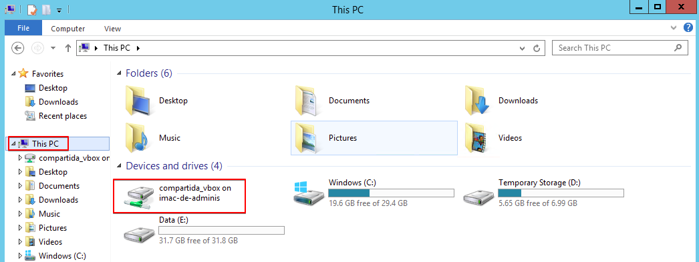

Cuando termines la configuración, la conexión guardada aparecerá en la página principal del cliente.

!!! warning "La IP puede cambiar"
    Si detienes y vuelves a iniciar la instancia, AWS puede asignarle otra IP pública. Consulta la dirección actual y actualiza el cliente RDP antes de conectarte.

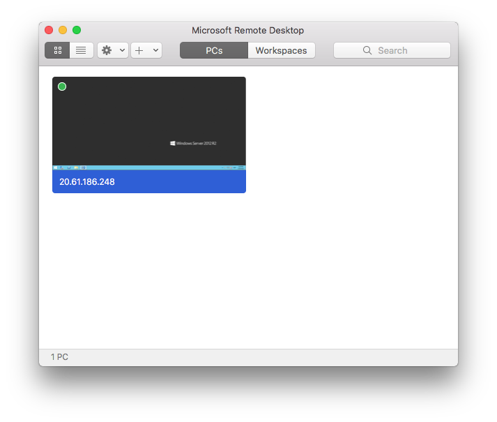

## Elimina la instancia

Cuando ya no necesites la instancia, guarda los archivos que quieras conservar y **termínala** desde EC2. Terminarla es definitivo; los volúmenes configurados para eliminarse también se borrarán. Una instancia detenida puede conservar almacenamiento que siga consumiendo recursos.

Elimina el grupo de seguridad solo cuando ya no esté asociado a ninguna instancia ni lo necesite otra práctica.

## Finaliza el laboratorio

Al acabar, vuelve a AWS Academy y pulsa **Finalizar laboratorio**. Finalizarlo cierra la sesión, pero no des por hecho que elimina la instancia o los demás recursos: comprueba que has detenido o terminado lo que ya no necesitas.

