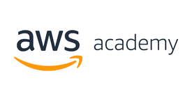
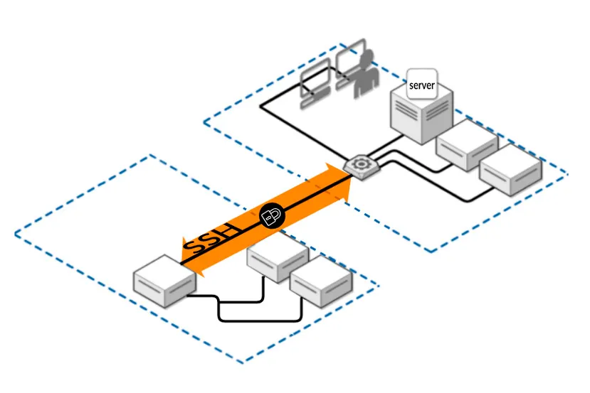

En este apartado aprenderás a crear y administrar máquinas virtuales en **AWS Academy**. Las utilizaremos como servidores para instalar PostgreSQL, otros SGBD y los servicios necesarios para realiza las prácticas de este módulo.



## ¿Qué son AWS Academy y EC2?

**AWS Academy** proporciona un entorno educativo de AWS con laboratorios y recursos limitados. Dentro del laboratorio accederás a la consola de AWS con la cuenta y los permisos definidos por el profesorado.

**Amazon EC2** es el servicio que permite crear servidores virtuales en la nube. Cada servidor que creemos será una **instancia EC2**. Una instancia tiene, entre otros elementos:

* una imagen del sistema operativo (AMI);
* un tipo de instancia, que determina la CPU y la memoria;
* un volumen de almacenamiento, normalmente EBS;
* una red y una dirección IP;
* uno o varios grupos de seguridad;
* un par de claves para el acceso inicial.

La creación es parecida para Linux y Windows, pero el acceso cambia: en Linux usaremos normalmente **SSH** y en Windows **RDP**.

!!! warning "El laboratorio tiene un ciclo de vida"
    Antes de trabajar, inicia el laboratorio y comprueba que la consola de AWS está disponible. Al terminar, detén las instancias que no necesites y finaliza el laboratorio de AWS Academy. Así evitarás consumir saldo y recursos innecesariamente.

## Conceptos imprescindibles

### Región, instancia e IP

* La **región** es la zona geográfica de AWS donde se crea el recurso. Trabaja siempre en la región indicada por el profesor.
* Una **instancia** es la máquina virtual en ejecución.
* La **IP privada** se utiliza dentro de la red de AWS.
* La **IP pública** o el DNS público permiten conectarse desde Internet. Una IP pública puede cambiar al detener y volver a iniciar una instancia, por lo que hay que consultarla antes de conectar.

### Grupo de seguridad

Un **grupo de seguridad** es el cortafuegos asociado a la instancia. Sus reglas indican qué tráfico puede entrar o salir. Una regla debe especificar, como mínimo, el protocolo, el puerto y el origen o destino.

Reglas habituales del módulo:

| Servicio | Protocolo y puerto | Uso |
| --- | --- | --- |
| SSH | TCP 22 | Administración de Linux |
| RDP | TCP 3389 | Escritorio remoto de Windows |
| HTTP | TCP 80 | Aplicaciones web sin cifrar |
| HTTPS | TCP 443 | Aplicaciones web cifradas |
| PostgreSQL | TCP 5432 | Conexión al SGBD, solo cuando la práctica lo necesite |
| MySQL / MariaDB | TCP 3306 | Conexión al SGBD, solo cuando la práctica lo necesite |

Para administrar una máquina, permite SSH o RDP únicamente desde tu IP siempre que sea posible. No abras puertos de administración ni de bases de datos a todo Internet (`0.0.0.0/0`) salvo que la práctica lo exija. Un puerto abierto en el grupo de seguridad no sustituye a la autenticación del sistema operativo.

Los SGBD suelen aceptar conexiones locales sin necesidad de abrir el puerto en AWS. Solo añade una regla para el puerto **5432** o **3306** cuando un cliente situado fuera de la instancia tenga que conectarse. En ese caso, limita el origen a la IP del cliente o a la IP privada del grupo de servidores que deba acceder.

### Par de claves

Un **par de claves** está formado por una clave pública y una clave privada:

* AWS asocia la clave pública a la instancia durante su creación.
* La clave privada se descarga una sola vez, normalmente como archivo `.pem`, y se guarda en el equipo del alumno.
* La clave privada no se comparte, no se sube al servidor y no se incluye en capturas ni repositorios.

En Linux, SSH utiliza la clave privada para demostrar que tienes la clave asociada a la clave pública instalada en el servidor. Además, SSH cifra la comunicación durante la sesión. La clave sirve para autenticarte; no es una contraseña ni una copia de seguridad.

!!! danger "Protege la clave privada"
    Si pierdes la clave privada, no podrás utilizarla para recuperar el acceso a una instancia. Si otra persona la obtiene, podría intentar acceder como tu usuario. Guárdala fuera del repositorio del módulo y limita sus permisos.

## Acceso a las instancias

### Linux mediante SSH

SSH proporciona una terminal remota segura. El puerto habitual es el **22**, pero deben estar permitidos tanto el puerto como el usuario y la clave correctos.

Datos necesarios para conectar:

1. DNS público o IP pública de la instancia.
2. Usuario de la AMI, por ejemplo `admin`, `debian` o `ubuntu`. No se puede adivinar: comprueba la documentación de la imagen utilizada.
3. Archivo de clave privada.
4. Regla de entrada TCP 22 en el grupo de seguridad.

Ejemplo general desde Linux, macOS o PowerShell:

```console
ssh -i ruta/a/clave.pem usuario@IP_PUBLICA
```

En Linux y macOS puede ser necesario proteger los permisos del archivo:

```console
chmod 400 clave.pem
```

Para terminar una sesión SSH:

```console
exit
```



### Windows mediante RDP

RDP proporciona un escritorio remoto. El puerto habitual es el **3389**. En la consola de EC2, la opción **Conectar** permite obtener los datos necesarios y, en Windows, descifrar la contraseña inicial del usuario `Administrator` usando la clave privada asociada a la instancia.

Necesitarás:

* el DNS público o la IP pública;
* el usuario `Administrator`;
* la contraseña descifrada desde la consola de EC2;
* una aplicación de escritorio remoto, como Conexión a Escritorio remoto, Remmina o KRDC;
* una regla de entrada TCP 3389 en el grupo de seguridad.

Después del primer acceso, cambia la contraseña si la práctica lo permite y no la guardes en documentos compartidos.

## Ciclo de trabajo recomendado

### Antes de conectarte

1. Inicia el laboratorio de AWS Academy.
2. Selecciona la región correcta.
3. Comprueba que la instancia está en estado **En ejecución**.
4. Consulta su IP pública o DNS público actual.
5. Comprueba el usuario, la clave y las reglas del grupo de seguridad.

### Mientras trabajas

* Pon nombres identificables a las instancias, volúmenes y grupos de seguridad.
* Abre únicamente los puertos que necesites.
* Comprueba la conectividad antes de diagnosticar PostgreSQL: estado de la instancia, IP, grupo de seguridad, servicio y firewall del sistema.
* Guarda en tus apuntes el nombre de la instancia, IP o DNS, usuario, puerto y nombre del grupo de seguridad. No guardes la clave privada ni contraseñas en esos apuntes.

### Al terminar

1. Guarda los cambios realizados en la instancia.
2. Detén la instancia si vas a continuar otro día. Al detenerla, el almacenamiento puede seguir generando consumo.
3. Termina la instancia cuando la práctica haya acabado y no necesites conservarla. Esta acción es irreversible y puede eliminar el volumen raíz según su configuración.
4. Elimina grupos de seguridad, volúmenes u otros recursos que ya no necesites, si el laboratorio lo permite.
5. Finaliza el laboratorio de AWS Academy.

!!! tip "Diagnóstico rápido"
    Si no puedes conectar, comprueba en este orden: laboratorio activo, instancia en ejecución, IP o DNS actual, usuario correcto, clave privada correcta y grupo de seguridad. Un error de conexión no implica necesariamente que PostgreSQL esté mal configurado.

## Lista de comprobación

Antes de dar por terminada una práctica, comprueba:

* [ ] Sé en qué región está mi instancia.
* [ ] Sé qué sistema operativo, usuario y clave utiliza.
* [ ] El grupo de seguridad solo permite los puertos necesarios.
* [ ] He comprobado la IP pública actual.
* [ ] Puedo acceder por SSH o RDP.
* [ ] El servicio que estoy probando está iniciado y escucha en el puerto esperado.
* [ ] He detenido o terminado los recursos que ya no necesito.
* [ ] He finalizado el laboratorio.
